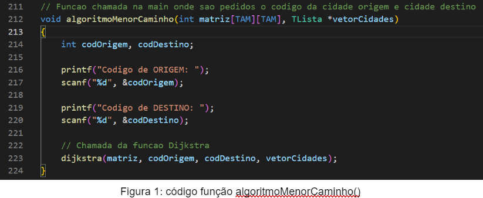
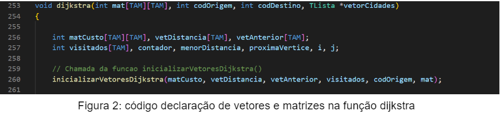
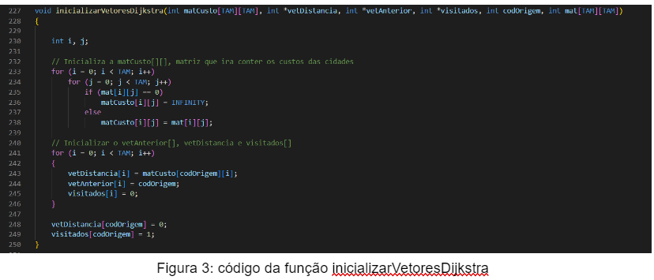
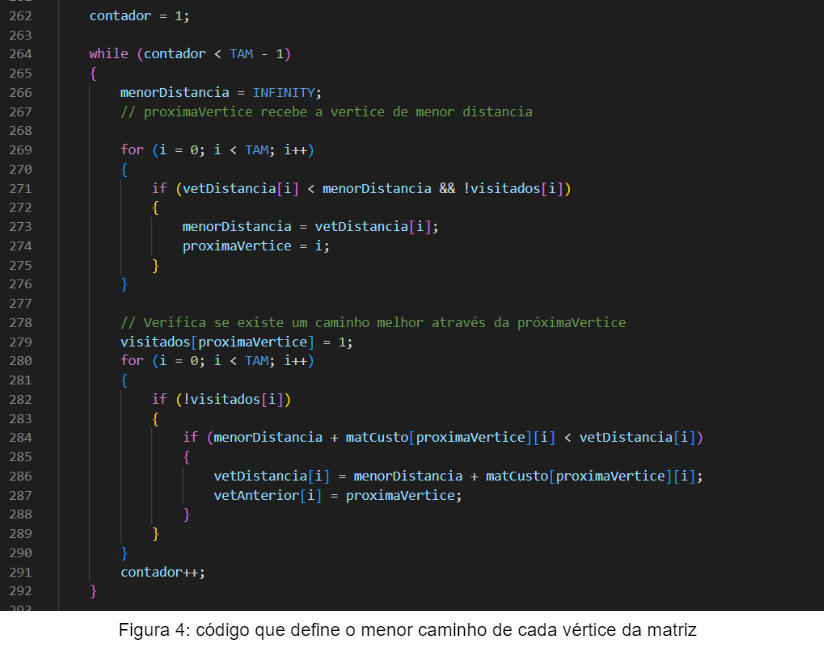
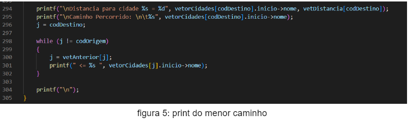

# Relatório descrevendo a estrutura do algoritmo Dijkstra

## INTRODUÇÃO
> - O algoritmo de Dijkstra é um dos algoritmos que calcula o caminho de custo mínimo entre vértices de um grafo. O código abaixo demonstra a implementação desse algoritmo utilizando a linguagem de programação C.

## IMPLEMENTAÇÃO
> - Para a implementação do algoritmo foram utilizadas três funções: algoritmoMenorCaminho(), inicializarVetoresDijkistra() e dijkstra().

> - Na algoritmoMenorCaminho(), o usuário irá inserir o código da cidade de origem e o código da cidade de destino. Os códigos das cidades são transferidos para as variáveis “codOrigem” e “codDestino” que são passadas como parâmetro da dijkstra() na linha 223.
> - Na função dijkstra, são criados vetores e matriz que serão inicializados pela função inicializarVetoresDijkstra().

> - A matCusto[][] é uma matriz que irá fazer uma cópia da matriz original, no entanto, onde é 0 na matriz original, passará ser Infinito (INFINITY) que foi definido como uma variável global com valor de 9999.
> - O vetDistancia[] irá receber todas as distâncias do vetor de origem, exceto na posição do código de origem, que irá receber o valor de 0.
> - O vetAnterior[] é inicializado como todas as posições sendo iguais ao código de origem.
> - O vetVisitados[] recebe em quase todas as posições 0, exceto na posição do código de origem, que no caso é 1.

> - No primeiro for (linha 269), é definido a menor vértice e se ela já foi visitada. A menor distância é guardada na variável “menorDistancia” e sua posição na variável “proximVertice”.
> - No segundo for (linha 280), é feita uma análise das vértices ainda não visitadas e é conferido se elas possuem a distância (menor caminho)  menor do que a presente no vetDistancia[].
> - Se for menor, a vértice é colocada no vetAnterior onde o menor caminho será escolhido.
> - Na linha 291, o contador é incrementado, dessa forma é feito o cálculo para o menor caminho de todas as cidades.

> - Por fim, é printado a saída com o menor caminho percorrido entre a cidade origem selecionada e a cidade destino.
